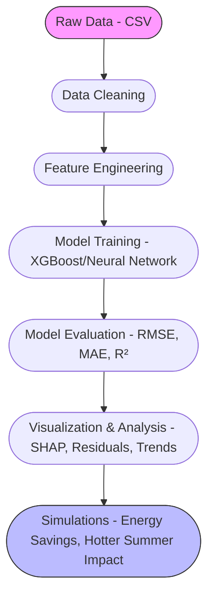
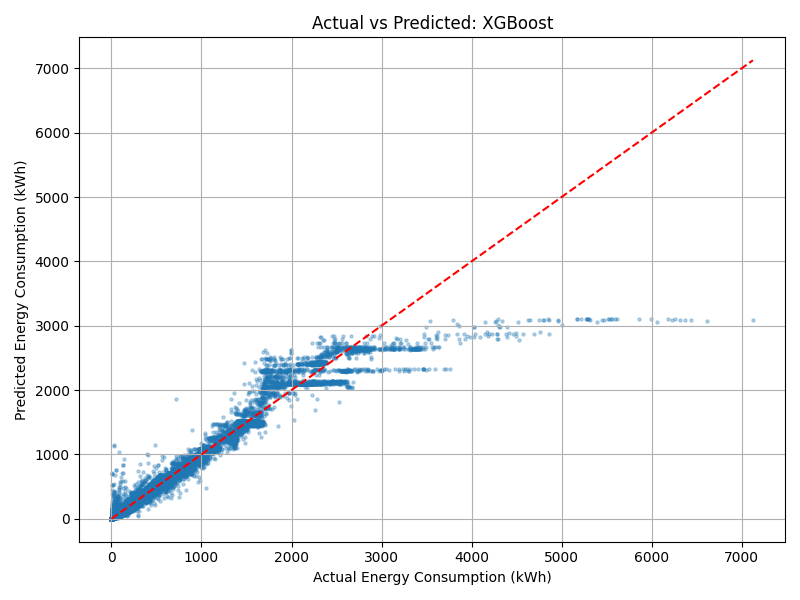
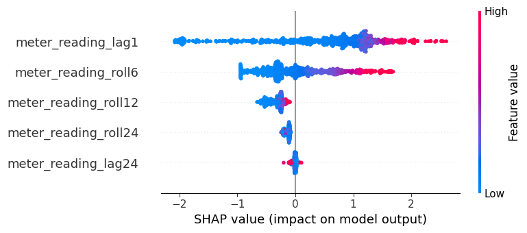
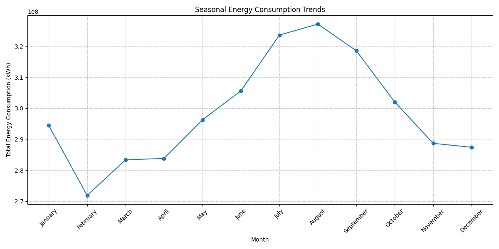

# Energy Consumption Forecasting and Analysis

This project developed a building energy consumption forecasting model using XGBoost, selected as the final model after comparative testing against Neural Networks. In addition to predictive modeling, the analysis simulated energy savings scenarios and assessed sensitivity to external environmental factors, including temperature increases.

---

## 📦 Project Structure

```bash
├── data/
│   ├── raw/            # Original input datasets
│   ├── interim/        # Cleaned and partially processed data
│   ├── processed/      # Fully processed data ready for modeling
├── models/             # Saved machine learning models
├── reports/            # Evaluation metrics, predictions, simulation results
├── plots/              # Visualization outputs
├── ├── eda/
│   ├── xgboost/
│   ├── neural_network/
│   ├── model_comparison/
├── scripts/             # All Python scripts
│   ├── utils.py                # Utility functions (splitting, loading)
│   ├── Genome_P2.R             # Exploratory data analysis and visualization (in R)
│   ├── Genome_EDA.Rmd          # Data cleaning and EDA Markdown
│   ├── data_cleaning.py        # preprocessing before modelling 
│   ├── feature_engineering.py  # Feature creation (lags, datetime, rolling stats), merge datasets
│   ├── xgboost_modelling.py    # XGBoost model training and evaluation
│   ├── neural_network_modelling.py # Neural Network model training and evaluation
│   ├── analysis.py             # For visualization and analysis
│   ├── runner.py               # Interactive menu to run full pipeline
│   ├── Race to Energy Efficiency.ipynb # Full notebook flow
├── Makefile            # Quick automation commands
├── requirements.txt    # Python package requirements
└── README.md           # Project overview
```

---
## 📈 Project Flow Overview

<details open>
<summary>Click to expand/collapse Project Flowchart</summary>


</details>

## 📚 Dataset

- **Name**: Building Data Genome Project 2
- **Source**: [Kaggle Page](https://www.kaggle.com/datasets/claytonmiller/buildingdatagenomeproject2)
- **Description**: Hourly energy consumption readings for 1,636 commercial buildings across North America and Europe (2016–2017).

**Important Note:**  
Due to GitHub file size limitations, the `electricity.csv` file is not included in the `data/raw/` folder.  
To run the project:

1. Download `electricity.csv` from the [Kaggle dataset page](https://www.kaggle.com/datasets/claytonmiller/buildingdatagenomeproject2).
2. Place it manually inside the `data/raw/` directory:

## 🚀 Setup Instructions

1. **Install Requirements:**

```bash
pip install -r requirements.txt
```

2. **Run Full Pipeline with Menu:**

```bash
python runner.py
```

or use **Makefile**:

```bash
make all
```
3. **Alternatively, Run the Full Pipeline in Jupyter Notebook**
```bash
Race to Energy Efficiency
```
> 📓 **Notebook = Code + Report + Analysis**  

The notebook is not just for code execution — it also serves as a detailed **report** containing:

- ✅ Step-by-step **explanations** alongside code
- 📈 **Visualizations** (plots, SHAP graphs, residual analysis)
- 💬 **Commentary and interpretations** of results
- 📚 **Business insights and recommendations** based on model outputs
- 🎯 **Full pipeline walkthrough**: from raw data to insights and simulations

Ideal for **review, deeper understanding**, or **presentation purposes**!
---
## 🧠 Core Scripts

| Script                        | Purpose                                                                           |
|:------------------------------|:----------------------------------------------------------------------------------|
| `Genome_P2.R`                 | Exploratory Data Analysis (EDA) using R, including visualization                                                           |
| `data_cleaning.py`            | Load raw data, clean missing values, process metadata                             |
| `feature_engineering.py`      | Create datetime features, lag/rolling features, merge datasets                    |
| `xgboost_modelling.py`        | Train XGBoost model, evaluate, save predictions                                   |
| `neural_network_modelling.py` | Train Neural Network model, evaluate, save predictions                            |
| `analysis.py`                 | Visualizations, SHAP explainability, simulations (energy savings, hotter summers) |
| `runner.py`                   | Menu-based full pipeline runner                                                   |

---

## 📊 Key Features

- **Time-Based Splitting** (before/after 2017-01-01)
- **XGBoost and Neural Network Comparison**
- **SHAP Explainability** for feature importance
- **Residual Analysis** to detect anomalies
- **Energy Savings Simulation** (10%, 20% reduction scenarios)
- **Hotter Summer Impact Simulation** (+8°C stress testing)
- **Model Performance Evaluation** (RMSE, MAE, R²)

---

## 📈 Example Plots

<details open>
<summary>1. Actual vs Predicted Scatter (XGBoost)</summary>



Shows the relationship between true and predicted energy consumption values.

</details>

---

<details>
<summary>2. SHAP Feature Importance</summary>



Explains which features most impacted model predictions.

</details>

---

<details>
<summary>3. Seasonal Energy Trends</summary>



</details>


## 📈 Example Outputs

| Plot | Description |
|:---|:---|
| Actual vs Predicted Scatter | Model prediction accuracy |
| Residual Distribution | Error distribution analysis |
| SHAP Summary | Feature contribution explainability |
| Seasonal Energy Trend | Monthly energy patterns |
| Hotter Summer Simulation | Impact of +8°C on cooling load |

---

## 💬 Notes

- All outputs (plots, reports) are automatically saved into `plots/` and `reports/`.
- Flexible and modular code: easy to add new models or simulations later.

---

## ✨ Future Work

- Incorporate weather forecast data for future predictions
- Further strain-test of XGBoost model by analyzing 2016+2017 as training and carrying out predictions/test on totally unforeseen data of 2018

---

## 👨‍💻 Contributors

- **Edidiong Ibokete** ([iboketee@canisius.edu](mailto:iboketee@canisius.edu))  
   Predictive Modeling Lead and Business Insight Development

- **Julia Hise** ([hisej@canisius.edu](mailto:hisej@canisius.edu))  
  Business Insight Development and Reporting

- **Nuzaif Naveed** ([naveedn@canisius.edu](mailto:naveedn@canisius.edu))  
  Exploratory Data Analysis and Data Preparation

- **Rasim Yamac** ([yamacr@canisius.edu](mailto:yamacr@canisius.edu))  
  Predictive Modeling and Repository Development and Management

---
